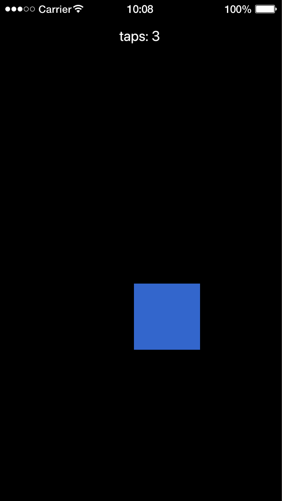

# DMC-Corona-Library

The DMC libraries for Solar2D (formerly Corona SDK) in one folder: objects, gestures, drag and drop, networking (sockets, WebSockets, WAMP), colors, storage and more.

**Version 2.0, brought fully up to date in 2026.** Every library has been fixed for current Solar2D and has unit tests, and each is documented in its own repository with a Quick Start and reference (dmc-multitouch's documentation is still to come); most come with example apps.

Each library is written and documented in its own repository; this one only collects copies of them, so a project can take all of them in one clone, at versions that work together. It also includes [DMC-Lua-Library](https://github.com/dmccuskey/DMC-Lua-Library), the plain-Lua modules they are built on, and [dmc-corona-boot](https://github.com/dmccuskey/dmc-corona-boot), the loader that lets them find each other.

The old 1.x library is on the `dmc_corona-1.x` branch.

## Libraries

Everything is in `dmc_corona/`. Each library's repository has its Quick Start, API reference, examples and known issues.

| module | repository | what it is |
|---|---|---|
| `dmc_autostore` | [dmc-autostore](https://github.com/dmccuskey/dmc-autostore) | Automatic JSON storage: change your app's data and it is saved, with no save calls |
| `dmc_bytearray` | [dmc-bytearray](https://github.com/dmccuskey/dmc-bytearray) | A byte buffer for binary data, such as a network protocol's |
| `dmc_dragdrop` | [dmc-dragdrop](https://github.com/dmccuskey/dmc-dragdrop) | Drag and drop, with each drop area deciding what it accepts |
| `dmc_e4x` | [dmc-e4x](https://github.com/dmccuskey/dmc-e4x) | Read XML with dot syntax: `xml.book.title` |
| `dmc_error` | [dmc-error](https://github.com/dmccuskey/dmc-error) | `try`, `catch` and `finally`, and error classes you can raise and recognize |
| `dmc_events_mix` | [dmc-events-mixin](https://github.com/dmccuskey/dmc-events-mixin) | `addEventListener()`, `removeEventListener()` and `dispatchEvent()` for any object |
| `dmc_files` | [dmc-files](https://github.com/dmccuskey/dmc-files) | Read and write text, lines, JSON and config files in one call each |
| `dmc_gestures` | [dmc-gestures](https://github.com/dmccuskey/dmc-gestures) | Tap, long press, pan and pinch recognizers, modeled on iOS |
| `dmc_kolor` | [dmc-kolor](https://github.com/dmccuskey/dmc-kolor) | Colors in 0-255, hex and names like "Steel Blue" |
| `dmc_kompatible` | [dmc-kompatible](https://github.com/dmccuskey/dmc-kompatible) | Run Graphics 1.0 code in Graphics 2.0: colors in 0-255, objects placed by reference points |
| `dmc_kozy` | [dmc-kozy](https://github.com/dmccuskey/dmc-kozy) | Graphics 1.0 conveniences (0-255 colors, reference points) in Graphics 2.0 code |
| `dmc_lifecycle_mix` | [dmc-lifecycle-mixin](https://github.com/dmccuskey/dmc-lifecycle-mixin) | Batch property changes: an object redraws once per frame, however many change |
| `dmc_megaphone` | [dmc-megaphone](https://github.com/dmccuskey/dmc-megaphone) | One shared object that any part of an app can send messages to and listen on |
| `dmc_mockserver` | [dmc-mockserver](https://github.com/dmccuskey/dmc-mockserver) | Mock a server's API in the app, to build and test before the server exists or without a network |
| `dmc_multitouch` | [dmc-multitouch](https://github.com/dmccuskey/dmc-multitouch) | Move, pinch and rotate for display objects |
| `dmc_navigator` | [dmc-navigator](https://github.com/dmccuskey/dmc-navigator) | Stack screens and slide between them, like a phone's navigation controller |
| `dmc_netstream` | [dmc-netstream](https://github.com/dmccuskey/dmc-netstream) | Receive data from an HTTP server as it arrives |
| `dmc_nicenet` | [dmc-nicenet](https://github.com/dmccuskey/dmc-nicenet) | A better behaved `network`: requests wait in a queue, a few at a time, by priority |
| `dmc_objects` | [dmc-objects](https://github.com/dmccuskey/dmc-objects) | Classes for game objects that move, animate and listen like display objects |
| `dmc_patch` | [dmc-patch](https://github.com/dmccuskey/dmc-patch) | Python-style additions: `%` string formatting, `table.pop()`, `pnotice()`/`pwarn()` |
| `dmc_path` | [dmc-path](https://github.com/dmccuskey/dmc-path) | Parse and build file paths and `require` strings |
| `dmc_performance` | [dmc-performance](https://github.com/dmccuskey/dmc-performance) | Time the parts of an app and watch its memory, from the console |
| `dmc_promise` | [dmc-promise](https://github.com/dmccuskey/dmc-promise) | Deferreds and promises, for results that arrive later |
| `dmc_sockets` | [dmc-sockets](https://github.com/dmccuskey/dmc-sockets) | Non-blocking TCP sockets with callbacks or events, and TLS |
| `dmc_states_mix` | [dmc-states-mixin](https://github.com/dmccuskey/dmc-states-mixin) | Turns any object into a state machine |
| `dmc_touchmanager` | [dmc-touchmanager](https://github.com/dmccuskey/dmc-touchmanager) | True multi-touch: several touches can hold focus on one display object |
| `dmc_trajectory` | [dmc-trajectory](https://github.com/dmccuskey/dmc-trajectory) | Parabolic motion: move a display object in an arc, like a thrown ball |
| `dmc_utils` | [dmc-utils](https://github.com/dmccuskey/dmc-utils) | Small helpers for tables, strings, URLs, audio, the status bar and more |
| `dmc_wamp` | [dmc-wamp](https://github.com/dmccuskey/dmc-wamp) | A [WAMP](https://wamp-proto.org/) client: remote procedure calls and publish/subscribe |
| `dmc_websockets` | [dmc-websockets](https://github.com/dmccuskey/dmc-websockets) | A WebSocket client (RFC 6455) |
| `lib/dmc_lua/` | [DMC-Lua-Library](https://github.com/dmccuskey/DMC-Lua-Library) | The plain-Lua modules the libraries are built on |

[dmc-facebook](https://github.com/dmccuskey/dmc-facebook) (a Facebook connector) isn't included: it was written for a Facebook login flow that has since changed, and is on hold.

## Quick Start

The following code will get you up and running in about 10 minutes in the Solar2D Simulator on macOS or Windows. It makes a square that you drag with a pan gesture and tap, and a label that counts the taps, told about each one on the megaphone: two libraries from the bundle working together.

Prerequisites: the [Solar2D](https://solar2d.com/) Simulator and a copy of this repository (`git clone https://github.com/dmccuskey/DMC-Corona-Library.git`, or download the ZIP from GitHub).

### 1. Copy the Library into Your Project

Copy these from this repository into the root of your project folder:

```text
dmc_corona_boot.lua     loader for the DMC libraries
dmc_corona.cfg          configuration
dmc_corona/             every library, and the modules they use
```

**Going further:** keep the libraries in a subfolder ([dmc-corona-boot Configuration](https://github.com/dmccuskey/dmc-corona-boot/blob/master/docs/configuration.md)).

### 2. A Square and a Label

Create `main.lua` in the project folder:

```lua
local Gesture = require 'dmc_corona.dmc_gestures'
local Megaphone = require 'dmc_corona.dmc_megaphone'

local cx, cy = display.contentCenterX, display.contentCenterY

-- a label that listens on the megaphone; it knows nothing of the square
local label = display.newText( 'taps: 0', cx, 80, native.systemFont, 32 )

Megaphone:listen( function( event )
	if event.type == 'tapped' then
		label.text = 'taps: ' .. event.data.count
		print( 'heard', event.type, event.data.count )
	end
end )

-- a square to drag around and tap
local square = display.newRect( cx, cy, 150, 150 )
square:setFillColor( 0.2, 0.4, 0.8 )

local pan = Gesture.newPanGesture( square )
local dx, dy  -- the square's offset from the touch

pan:addEventListener( pan.EVENT, function( event )
	if event.type ~= pan.GESTURE then return end
	if event.phase == 'began' then
		dx, dy = square.x - event.x, square.y - event.y
	else  -- 'changed' or 'ended'
		square.x, square.y = event.x + dx, event.y + dy
	end
end )

local count = 0
local tap = Gesture.newTapGesture( square )

tap:addEventListener( tap.EVENT, function( event )
	if event.type ~= tap.GESTURE then return end
	count = count + 1
	Megaphone:say( 'tapped', { count=count } )
end )
```

Open the project in the Simulator. Drag the square down and to the right, then click it three times: the label counts the taps, and the console shows:

```text
WARNING: Simulator does not support multitouch events
heard	tapped	1
heard	tapped	2
heard	tapped	3
```



The warning comes from Solar2D when dmc-gestures turns multitouch on; a device doesn't print it.

If the console shows `module 'dmc_corona.dmc_gestures' not found` instead, `dmc_corona/` is missing from the root of the project folder.

**Going further:** each library's own Quick Start and examples, in its repository ([Libraries](#libraries)).

To update, copy `dmc_corona_boot.lua` and `dmc_corona/` again from the newer version. Keep your own `dmc_corona.cfg` if you have changed it.

## Configuration

`dmc_corona.cfg` here has only the `[DMC_CORONA]` section, which tells the loader where the libraries are. A library with settings reads its own section, such as `[DMC_KOLOR]` or `[DMC_SOCKETS]`; add the sections you need to your copy. Each library's settings are in the Configuration section of its API reference, and the file's format in [dmc-corona-boot's Configuration](https://github.com/dmccuskey/dmc-corona-boot/blob/master/docs/configuration.md).

## Documentation

- Each library's documentation: its repository ([Libraries](#libraries))
- [Design notes](docs/design-notes.md): how the library's architecture came to be (incomplete, from 2011-2014)

## Development

Nothing in `dmc_corona/` is edited here: fix a library in its own repository, then rebuild. The tests are there too, in each library's repository. The build uses [Snakemake](https://snakemake.readthedocs.io/) (last run with 7.32). The `Snakefile` lists the files and the repositories they come from, `snakemake/Snakefile` holds the rules that every DMC library's build uses, and each library repository registers its files in its own `Snakefile`.

A build copies from checkouts of the library repositories next to this one (`../dmc-objects/` and so on), on whatever branch each one has checked out. From this repository's root folder:

```sh
snakemake --cores 1 build_module
```

Snakemake decides what to copy by file times; `--forceall` copies every file. Until the next build, a copy here can be older than its repository.

## License

The libraries are released under the [MIT License](LICENSE).
